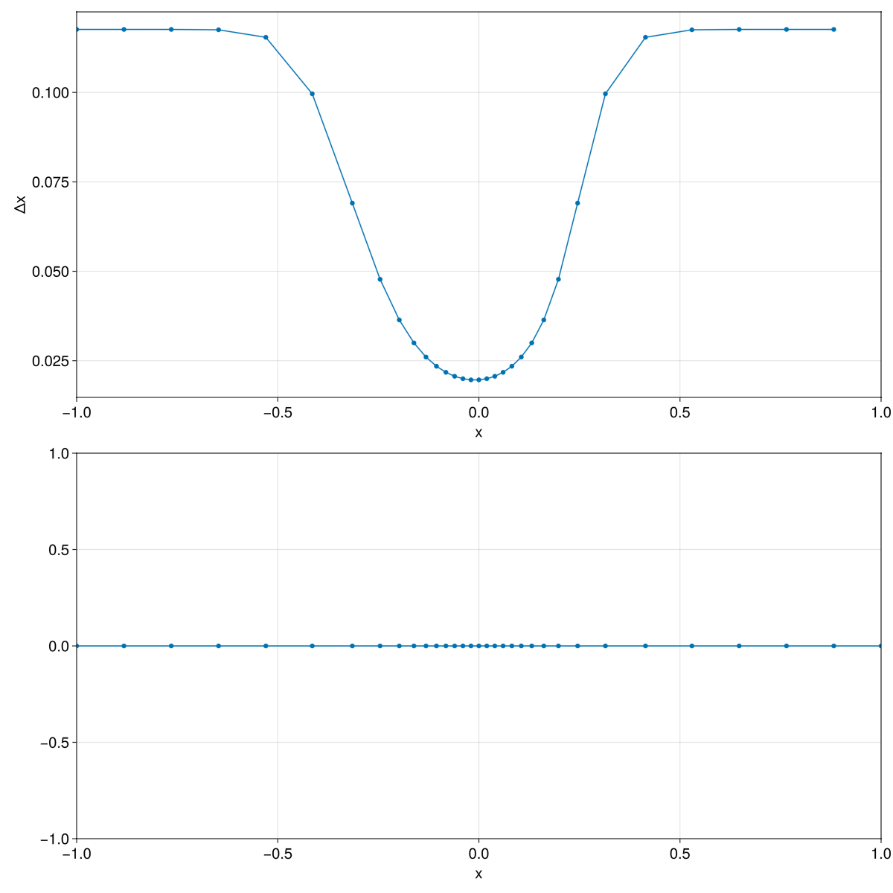

# PoissonGrids.jl

`PoissonGrids.jl` generates one-dimensional adaptive grids from scalar monitor
functions.

## Quick Start

```julia
using PoissonGrids

M = gaussian_monitor(5.0, 0.0, 0.2)
u = solve_grid(-1.0, 1.0, M, 32)
```

The returned vector `u` contains the grid vertices.


