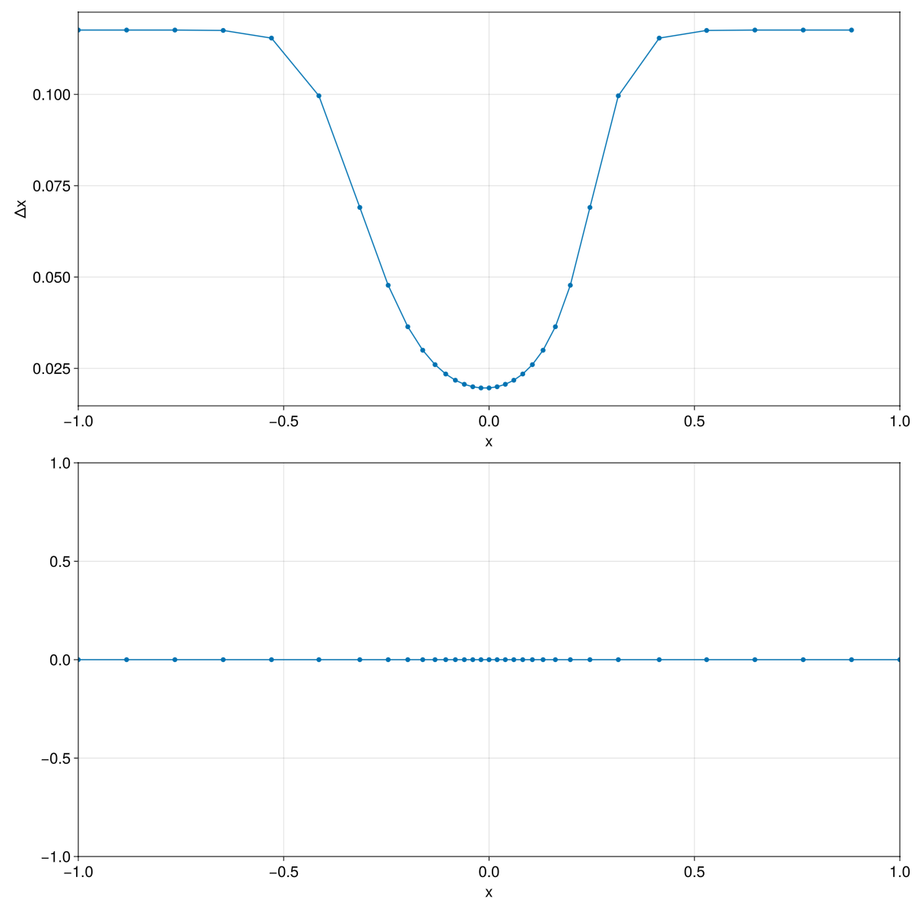

# PoissonGrids.jl

[](https://github.com/albert-de-montserrat/PoissonGrids.jl/actions/workflows/ci.yml)
[](https://albert-de-montserrat.github.io/PoissonGrids.jl/dev/)
[](https://codecov.io/gh/albert-de-montserrat/PoissonGrids.jl)

`PoissonGrids.jl` generates one-dimensional adaptive grids from scalar monitor
functions.

A *monitor function* `M(x) > 0` states where resolution is wanted: the solver
places grid vertices so that cell width is inversely proportional to `M`, so
regions where `M` is large end up finely resolved. The package provides
[`solve_grid`](https://albert-de-montserrat.github.io/PoissonGrids.jl/dev/api/)
together with three ready-made monitors — `gaussian_monitor`, `tanh_monitor`
and `window_monitor` — though any positive, finite callable works.

## Installation

```julia
using Pkg
Pkg.add("PoissonGrids")
```

## Quick Start

```julia
using PoissonGrids

M = gaussian_monitor(5.0, 0.0, 0.2)
xmin, xmax = -1.0, 1.0 # domain limits
nc = 32 # number of cells
u = solve_grid(xmin, xmax, M, nc; verbose = false)
```

The returned vector `u` contains the `nc + 1` grid vertices, with the endpoints
fixed at `xmin` and `xmax`.



See the [documentation](https://albert-de-montserrat.github.io/PoissonGrids.jl/dev/)
for the other monitors and for how the grid equation is solved.
