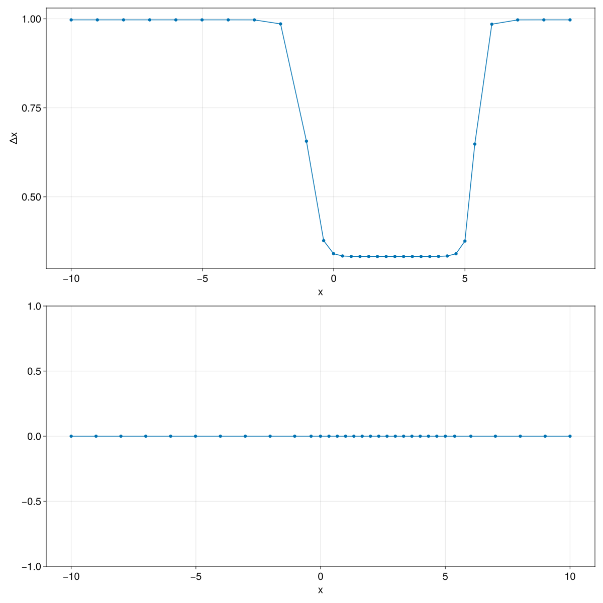

# PoissonGrids.jl

`PoissonGrids.jl` generates one-dimensional adaptive grids from scalar monitor
functions. The package currently exposes three monitor constructors,
[`gaussian_monitor`](@ref), [`tanh_monitor`](@ref), and
[`window_monitor`](@ref), together with the main solver [`solve_grid`](@ref).

## Overview

The solver starts from a uniform computational grid and iteratively relocates the
interior physical vertices. Regions where the monitor function is larger receive
more resolution in the final grid.

## Examples

### Gaussian Refinement

The Gaussian monitor used in this example is

```math
M(x) = 1 + \alpha \exp\left(-\frac{(x - x_c)^2}{\sigma^2}\right)
```

```@example quickstart
using PoissonGrids

M = gaussian_monitor(5.0, 0.0, 0.2)
u = solve_grid(-1.0, 1.0, M, 32);
```

The returned vector `u` contains the grid vertices


## Tanh Refinement

The tanh monitor used in this example is

```math
M(x) = 1 + \frac{\alpha + \alpha \tanh\left(\kappa (x - c)\right)}{2}
```

```@example tanh_example
using PoissonGrids

M = tanh_monitor(5.0, 20, 0.0)
u = solve_grid(-1.0, 1.0, M, 32);
```

This monitor transitions across a single interface, so the grid changes
smoothly from coarser cells on one side to finer cells on the other.

## Window Refinement

The window monitor used in this example is

```math
M(x) = 1 + \frac{\alpha}{2}
\left[
\tanh\left(\kappa (x - c + b)\right) - \tanh\left(\kappa (x - c - b)\right)
\right]
```

```@example window_example
using PoissonGrids

M = window_monitor(2, 2.5, 3, 2.5)
u = solve_grid(-10.0, 10.0, M, 32);
```

This monitor creates a smooth high-resolution window around the interval
`[c - b, c + b]`, with coarser cells outside the window.



## Choosing a Monitor

- Use [`gaussian_monitor`](@ref) when refinement should be concentrated around a
  localized feature.
- Use [`tanh_monitor`](@ref) when refinement should primarily favor one side of
  a single interface.
- Use [`window_monitor`](@ref) when refinement should be concentrated inside a
  finite interval with smooth edges.

## Notes

- `nc` is the number of cells, so the solution vector returned by
  [`solve_grid`](@ref) has length `nc + 1`.
- The domain endpoints remain fixed at `xmin` and `xmax`.
- A constant monitor such as `x -> 1.0` reproduces a uniform grid.
