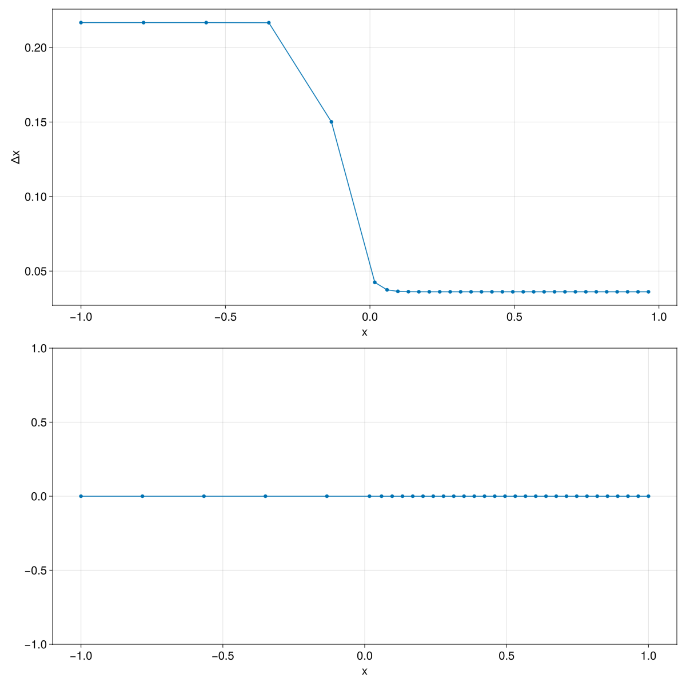

# PoissonGrids.jl

`PoissonGrids.jl` generates one-dimensional adaptive grids from scalar monitor
functions. The package currently exposes two monitor constructors,
[`gaussian_monitor`](@ref) and [`tanh_monitor`](@ref), together with the main
solver [`solve_grid`](@ref).

## Overview

The solver starts from a uniform computational grid and iteratively relocates the
interior physical vertices. Regions where the monitor function is larger receive
more resolution in the final grid.

## Examples

### Gaussian Refinement

The Gaussian monitor used in this example is

```math
M(x) = 1 + \alpha \exp\left(-\frac{(x - x_c)^2}{\sigma^2}\right)
```

```@example quickstart
using PoissonGrids

M = gaussian_monitor(5.0, 0.0, 0.2)
u = solve_grid(-1.0, 1.0, M, 32)
```

The returned vector `u` contains the grid vertices


## Tanh Refinement

The tanh monitor used in this example is

```math
M(x) = 1 + \frac{\alpha + \alpha \tanh\left(\kappa (x - c)\right)}{2}
```

```@example tanh_example
using PoissonGrids

M = tanh_monitor(5.0, 20, 0.0)
u = solve_grid(-1.0, 1.0, M, 32)
```

This monitor increases smoothly across `x = 0`, so the grid transitions from
coarser cells on the left to finer cells on the right.



## Choosing a Monitor

- Use [`gaussian_monitor`](@ref) when refinement should be concentrated around a
  localized feature.
- Use [`tanh_monitor`](@ref) when the mesh should transition smoothly across an
  interface or boundary layer.

## Notes

- `nc` is the number of cells, so the solution vector returned by
  [`solve_grid`](@ref) has length `nc + 1`.
- The domain endpoints remain fixed at `xmin` and `xmax`.
- A constant monitor such as `x -> 1.0` reproduces a uniform grid.
