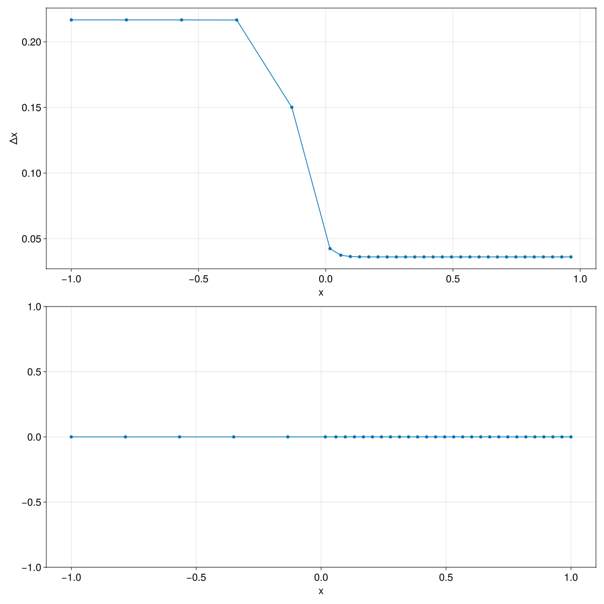
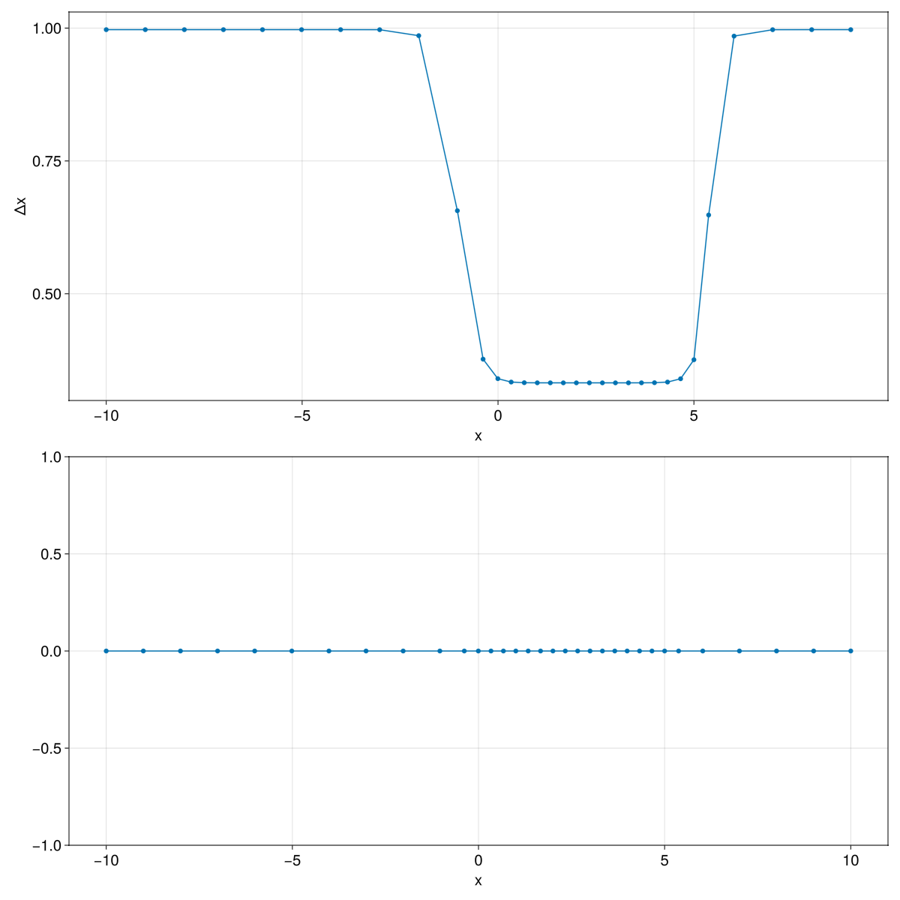

```@meta
DocTestSetup = quote
    using PoissonGrids
end
```

# PoissonGrids.jl

`PoissonGrids.jl` generates one-dimensional adaptive grids from scalar monitor
functions. The package exposes the solver [`solve_grid`](@ref) together with
three monitor constructors, [`gaussian_monitor`](@ref), [`tanh_monitor`](@ref),
and [`window_monitor`](@ref).

## How It Works

A *monitor function* `M(x) > 0` states where resolution is wanted. The grid is
the map `x(ξ)` from a uniform computational coordinate `ξ ∈ [0, 1]` onto the
physical domain that satisfies

```math
\frac{\mathrm{d}}{\mathrm{d}\xi}
\left( M(x) \, \frac{\mathrm{d}x}{\mathrm{d}\xi} \right) = 0 ,
\qquad x(0) = x_\mathrm{min}, \quad x(1) = x_\mathrm{max} .
```

Integrating once gives the **equidistribution principle**

```math
M(x) \, \frac{\mathrm{d}x}{\mathrm{d}\xi} = \text{constant},
```

so cell width is inversely proportional to the monitor: doubling `M` over some
region halves the cell width there. Two consequences are worth keeping in mind
when designing a monitor:

- Only the *relative* variation of `M` matters. Multiplying `M` by a constant
  leaves the grid unchanged, because the constant of integration absorbs it. The
  built-in monitors are therefore written as `1 + α·(shape)`, where `α` sets the
  refinement contrast against a background value of `1`.
- A constant monitor equidistributes trivially and reproduces the uniform grid:

```jldoctest
julia> solve_grid(-1.0, 1.0, x -> 1.0, 8)
9-element Vector{Float64}:
 -1.0
 -0.75
 -0.5
 -0.25
  0.0
  0.25
  0.5
  0.75
  1.0
```

The equation is solved by a pseudo-transient iteration that relaxes the interior
vertices toward the steady state, so there is no matrix to assemble. The
endpoints are held fixed throughout. Iteration stops once the normalized
residual drops below `tol`; if that does not happen within `maxiter` iterations,
[`solve_grid`](@ref) throws [`ConvergenceError`](@ref).

## Examples

### Gaussian Refinement

The Gaussian monitor concentrates resolution around a single location `xc`:

```math
M(x) = 1 + \alpha \exp\left(-\frac{(x - x_c)^2}{\sigma^2}\right)
```

```jldoctest
julia> M = gaussian_monitor(5.0, 0.0, 0.2);

julia> u = solve_grid(-1.0, 1.0, M, 32);

julia> length(u), first(u), last(u)
(33, -1.0, 1.0)

julia> round(maximum(diff(u)) / minimum(diff(u)); digits = 2)   # widest / narrowest cell
5.99
```


### Tanh Refinement

The tanh monitor steps from `1` to `1 + α` across a single interface, so the
grid coarsens smoothly on one side of `c` and refines on the other:

```math
M(x) = 1 + \frac{\alpha + \alpha \tanh\left(\kappa (x - c)\right)}{2}
```

```jldoctest
julia> M = tanh_monitor(5.0, 20, 0.0);

julia> M(0.0)   # midpoint of the transition, 1 + α/2
3.5

julia> u = solve_grid(-1.0, 1.0, M, 32);

julia> issorted(u), length(u)
(true, 33)
```



### Window Refinement

The window monitor combines two opposing tanh profiles into a refinement
plateau, giving high resolution inside `[c - b, c + b]` and coarser cells
outside it:

```math
M(x) = 1 + \frac{\alpha}{2}
\left[
\tanh\left(\kappa (x - c + b)\right) - \tanh\left(\kappa (x - c - b)\right)
\right]
```

```jldoctest
julia> M = window_monitor(2, 2.5, 3, 2.5);

julia> round(M(2.5); digits = 4)   # plateau value, close to 1 + α
3.0

julia> u = solve_grid(-10.0, 10.0, M, 32);

julia> round(minimum(diff(u)); digits = 3), round(maximum(diff(u)); digits = 3)
(0.332, 0.997)
```



## Choosing a Monitor

- Use [`gaussian_monitor`](@ref) when refinement should be concentrated around a
  localized feature.
- Use [`tanh_monitor`](@ref) when refinement should primarily favor one side of
  a single interface.
- Use [`window_monitor`](@ref) when refinement should be concentrated inside a
  finite interval with smooth edges.

Any positive, finite callable works as a monitor; the constructors above are
conveniences rather than a required type.

## Notes

- `nc` is the number of cells, so the solution vector returned by
  [`solve_grid`](@ref) has length `nc + 1`.
- The domain endpoints remain fixed at `xmin` and `xmax`.
- The monitor must remain strictly positive and finite on the evolving grid.
